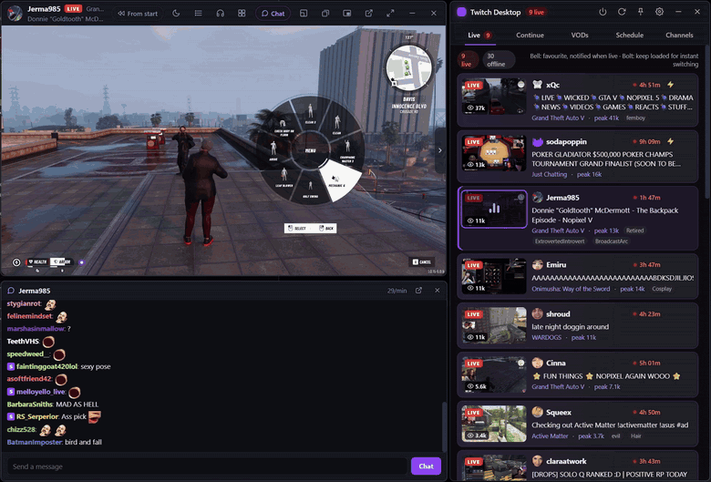
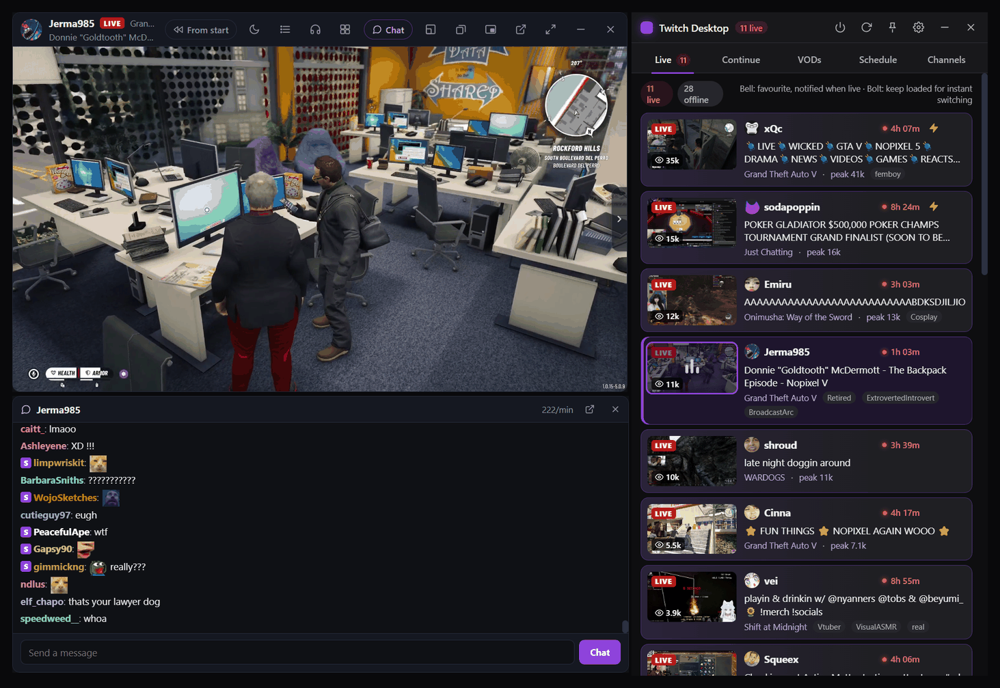
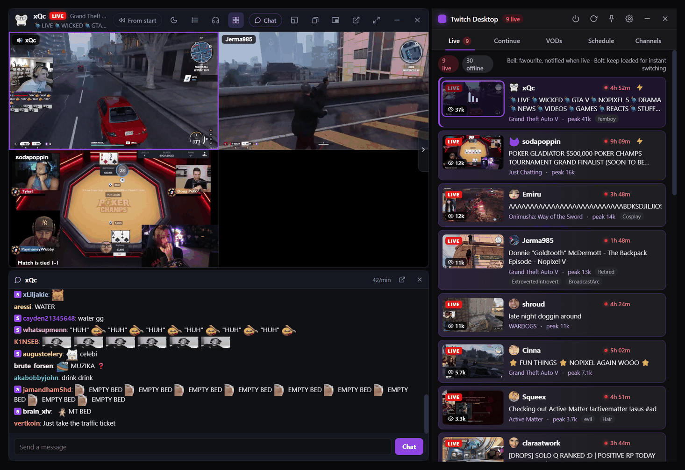
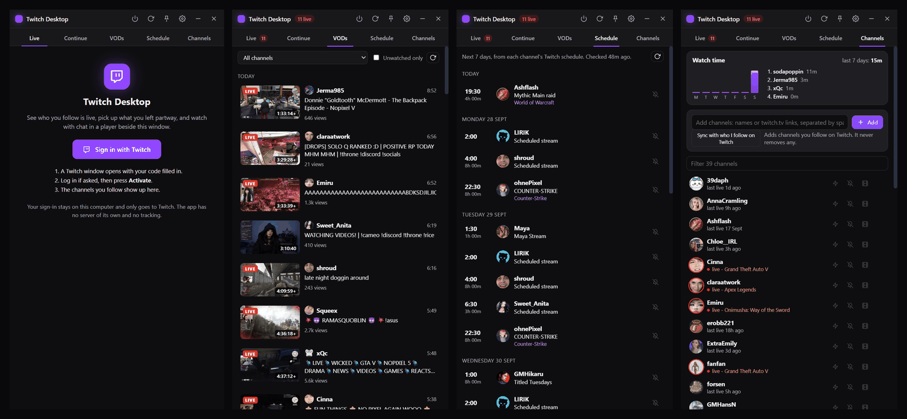

# Twitch Desktop

A desktop app for watching the channels you follow on Twitch, for Windows and Linux. It shows who's live, what you
left halfway through, past broadcasts and schedules, and plays streams in a player that docks beside the window
with chat.

Unofficial and not affiliated with Twitch (see the note at the bottom).



## What it does

- Live list of the channels you follow, favourites first, with toasts when a favourite goes live
- Continue: resume VODs you stopped partway, or rejoin/catch up on a live stream you left
- Past broadcasts per channel with saved progress, and everyone's schedule for the next week with reminders
- A player that docks next to the window, detaches, or shrinks to picture-in-picture, with live chat (7TV,
  BetterTTV and FrankerFaceZ emotes)
- Instant switching between streams, and multi-view for up to 4 at once
- Hides Twitch's title card and buttons over the video, so all you see is the stream (Settings can turn that off)
- Sleep timer, audio mode, per-channel volume, VOD chapters, skipping muted parts, following raids
- Game alerts and optional phone alerts through [ntfy](https://ntfy.sh)
- Sits in the tray and updates itself

There's no server, account or telemetry behind it. It talks to Twitch, the three emote services, GitHub (update
checks), and OpenRouter or ntfy only if you set those up.

## Screenshots







## Install

Grab the latest build from the [Releases page](https://github.com/Brownaye/twitch-desktop/releases/latest).

**Windows 10/11 (64-bit)**: `Twitch-Desktop-Setup-x.y.z.exe` is the normal installer and keeps itself up to date.
`Twitch-Desktop-x.y.z-portable.exe` runs without installing but won't update itself.

The builds aren't code-signed, so the first time you run one SmartScreen will say "Windows protected your PC".
Click **More info**, then **Run anyway**.

**Linux (64-bit)**: the AppImage works on most distros and updates itself:

```sh
chmod +x Twitch-Desktop-*.AppImage
./Twitch-Desktop-*.AppImage
```

If it won't start you're probably missing FUSE 2 (`libfuse2` on Ubuntu/Debian, `fuse2` on Arch). Running it from a
terminal shows the actual error.

There's also a `.deb` for Debian/Ubuntu (`sudo apt install ./twitch-desktop_*.deb`). That one doesn't auto-update,
so install the new .deb when a release comes out.

The installer and AppImage check for updates at startup and every 6 hours, download in the background, and install
when you click the notification or next time you quit.

## First launch

You can use it without an account: add channels by name on the Channels tab. Signing in is better though. Go to
Settings (the gear) > Twitch account > **Sign in with Twitch**, and a window opens on Twitch's own activation page
with the code filled in. Log in if it asks and press Activate. The app never sees your password.

Once signed in it pulls in the channels you follow (and checks again every 30 minutes, without ever removing any),
lets you chat, signs the player in so sub-only VODs play and your subs/Turbo apply, and follows raids.

It asks Twitch for these scopes:

- `user:read:follows` to see who you follow
- `chat:read` and `chat:edit` to read chat and send the messages you type
- `user:read:subscriptions` to know which channels you're subbed to
- `user:read:emotes` to show your sub and follower emotes in chat

It can't change your account, follow or unfollow anyone, or spend anything. **Sign out** in the same place deletes
the token and the player's cookies, and you can revoke access on Twitch under Settings > Connections.

## Player shortcuts

With the player focused:

| Key | |
| --- | --- |
| N / B | next / previous live channel |
| G | multi-view |
| D | detach / dock |
| P | picture-in-picture |
| 1-4 | player size |
| F11 | fullscreen (Esc to leave) |

Media keys (play/pause, next, previous) work while the player is open. Audio mode is the headphones button. Twitch
doesn't allow real audio-only in its embedded player, so it drops to 160p and hides the picture, which is about a
thirtieth of the data of 1080p.

## Chat recap (optional)

The "What's going on?" button under chat gives you a one-line summary of the last 5 minutes, which is handy when
you join partway through. It uses [OpenRouter](https://openrouter.ai) with your own API key: turn it on in
Settings and paste the key (you can pick the model there too). A few dollars of credit goes a long way. Only the
recent chat of the channel you're watching is sent, and only when you press the button.

## Your data

Everything is stored locally in:

- Windows: `%APPDATA%\Twitch Desktop`
- Linux: `~/.config/Twitch Desktop`

That's `config.json` (channels and settings, including your OpenRouter key if you set one), `state.json` (watch
progress, schedules, watch time and so on), `auth.json` (the Twitch token) and `app.log`. Tokens and keys are
redacted from the log.

To remove it all: sign out, uninstall (Windows: Settings > Apps; Linux: delete the AppImage or
`sudo apt remove twitch-desktop`), then delete that folder.

## Notes

- Ads and "certain audiences" warnings come from Twitch's own player. The app doesn't add or block anything.
  Signing in means your subs and Turbo remove ads the same way they do on the website.
- If something breaks, Settings > Activity log shows what the app is doing. Please
  [open an issue](https://github.com/Brownaye/twitch-desktop/issues/new/choose) with your OS, the app version and
  `app.log`.

## Building from source

You need Node.js 20 or later.

```sh
git clone https://github.com/Brownaye/twitch-desktop.git
cd twitch-desktop
npm install
npm start
```

Other scripts: `npm run dev` (with DevTools), `npm run check` (syntax check), `npm run dist` (installers for the
current OS into `dist/`), `npm run dist:win`, `npm run dist:linux` (build that one on Linux), `npm run icons`
(regenerates the icons in `assets/` and `build/`).

Sign-in needs a Twitch client ID. Releases have one built in (`BUILT_IN_CLIENT_ID` in `src/main/config.js`). To use
your own, register an app at [dev.twitch.tv/console](https://dev.twitch.tv/console) with the redirect URL
`http://localhost` and Client Type **Public** (no secret needed), then set `TWITCH_CLIENT_ID` in your environment.

Some flags that help when testing (`npm start -- <flags>`): `--data-dir=<path>` (or `TD_DATA_DIR`) for a separate
profile, `--view=live|continue|vods|channels|settings` to open on a tab, `--screenshot=<file>` with
`--shot-delay=<ms>`, and `--shot=`, `--click=` and `--eval=` for scripted checks (see `devHooks` in
`src/main/main.js`).

It's plain JavaScript on Electron 33 with no bundler or framework. If you add an IPC channel, it has to be listed
in the matching preload script or it gets blocked. The player controls work by finding Twitch's player object in
the embed's React tree (`CORE` in `src/renderer/player.js`), so if Twitch changes its embed, that's usually what breaks.

Issues and PRs are welcome. For anything big, open an issue first.

## Releasing

1. Bump the version (`npm version 1.1.0 --no-git-tag-version`), commit and push.
2. `git tag v1.1.0 && git push origin v1.1.0`
3. The Release workflow builds Windows and Linux and uploads everything to a draft release.
4. Edit the notes and publish it. Leave the `latest*.yml` and `.blockmap` files attached, auto-update needs them.

## License

[MIT](LICENSE), (c) 2026 Brownaye.

Twitch Desktop is an unofficial app. It is not affiliated with or endorsed by Twitch Interactive, Inc. Twitch is a
trademark of Twitch Interactive, Inc.
